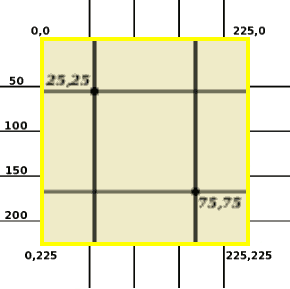

> 原文链接：http://www.ckollars.org/canvas-two-coordinate-scales.html
> 


# canvas：在两个坐标系之间自动缩放  

HTML中的canvas既简单又强大。它看上去需要相当复杂的编程只是做ho-hum的东西，但是实际上它可以做很多事情且很容易，它不能证明书呆子只是标志。要解锁它的全部力量，你应该在一定程度上了解它的工作原理。

## canvas背景
canvas标签通过同时使用2个不同的坐标系统提供复杂的功能。（不幸的是canvas经常忽略甚至去到可用的复杂性）  

canvas标签不同于几乎所有的其他HTML元素，在同时使用两个不同的坐标系统。当您想要在画布上绘制任何东西时，模型坐标系统是非常用于的。显示坐标系标度用于控制专用于画布的物理屏幕空间。你应该明确指定模型坐标大小作为HTML中的属性，以及css中的显示坐标大小。  


一些时候两个坐标系是相同的，提供1：1的无缩放映射（可能没有太多征服感~太简单？？）。大多数时候，两个坐标系处于不同的缩放刻度。（实际上，在一些情况下，X/水平缩放因子甚至不与Y/垂直缩放因子相同。）每当模型（model）和显示（display）比例不同时，浏览器总是自动缩放（和自动重新缩放）画布上绘制的所有内容，所以你永远不需要关心显式缩放（甚至不会改变当屏幕旋转时改变大小的画布）。  

有两个不同的坐标系统，一个用于在画布上绘制，另一个用于在页面中定位画布，这意味着你可以稍后更改网页的外观，而不影响绘图说明。更改显示画布的大小只会更改显示坐标；javascript绘图命令使用的模型坐标不受影响，所以，你可以更改画布的显示大小，而不必对相关的javascript进行任何修改。画布甚至可以在不同的设备上以不同的大小显示，但是所以的情况下都由同一个简单的javascript代码驱动。（你实际上从来不改变它的高度/宽度属性/属性来改变画布的模型比例。）


## 显示两个坐标系的示例

这里是一个两个坐标系的插图，这个canvas的模型尺寸为HTML中指定的100*100.在25,25和75,75处的交叉线使用模型坐标系。但是画布的实际物理显示（包括你在此网页上看到的内容）占用225*225像素的空间。（显示坐标系指css/显示像素，它们通常与物理像素相同，但对于具有少量显示器（特别是非常高分辨率的显示器）的浏览器可能是不同的。画布后面的网格在显示器坐标系中每50像素显示一条线，刚好在画布角的外部的标签在显示器坐标中。

> canvas使用与所有其他HTML/CSS相同类型的坐标系统，实际上几乎所有的pc图像和几乎所有的其他计算机图形处理：具有原点[0, 0]在左上方并且Y坐标在向下方向上增加的笛卡尔网络。这种用于计算机图形的坐标系是自然的，并且很快变得直观；他们不需要额外的规格或计算-甚至不要添加减号。

> 画布坐标和CSS坐标都是从零开始的，因此例如100像素宽的画布的列实际上从0到99编号。为了简单和关注两个同时坐标系的概念，下面的例子只是快乐地忽略了这个事实。



```html
<canvas id="cvs" width="100" height="100"><p>canvas unsupported</p></canvas>
```

```css
#cvs{width:225px;height:225px;}
```

```javascript
var cvs = document.getElementById('cvs'); 
var ctx = cvs.getContext('2d'); 
ctx.font = 'italic bold 8px serif'; 
ctx.lineWidth = 1; 
ctx.fillStyle = '#aaaa00'; 

firstcross(ctx); 
secondcross(ctx); 

function firstcross(context) { 
  context.moveTo(25,0); 
  context.lineTo(25,100); 
  context.stroke(); 

  context.moveTo(0,25); 
  context.lineTo(100,25); 
  context.stroke(); 

  context.beginPath(); 
  context.arc(25,25, 2, 0,Math.PI*2); 
  context.closePath(); 
  context.fill(); 

  context.fillText("25,25", 1,22); 
} 

function secondcross(context) { 
  context.moveTo(75,0); 
  context.lineTo(75,100); 
  context.stroke(); 

  context.moveTo(0,75); 
  context.lineTo(100,75); 
  context.stroke(); 

  context.beginPath(); 
  context.arc(75,75, 2, 0,Math.PI*2); 
  context.closePath(); 
  context.fill(); 

  context.fillText("75,75", 76,83); 
} 
```


## 指定两个坐标系

显示坐标系通过通过常用的css中的width:xxx和height:xxx 来指定。模型坐标系通过html源码中<canvas>的节点属性witdh=""和height=""。（在html源码中指定节点的width=""和height=""看起来非常奇怪甚至是个清楚的错误，因为当前对于大多数HTML标签都是不好的做法，但是canvas标签不像大多数HTML标签，它可以这样指定） 

如果坐标系不足，会发生什么？如果仅指定模型坐标系（通过canvas节点属性），这些值也将被复制到显示坐标，以代替css中的缺失值。结果将是没有缩放的1：1映射。如果你只指定了显式坐标系（通过css），模型坐标可能默认为意外值，导致意外的缩放和神秘的绘图命令。如果没有指定坐标系，模型坐标将使用默认值，那么这些值也将被复制到显示坐标。虽然这也是一个没有缩放的1：1映射，但是它会产生意向不到的画布尺寸。


## 保留长宽比

通常，不管是在模型坐标还是显示坐标中描述，画布都保持相同的宽高比是一个好主意。（为了更清晰的交流，下面一些例子不保持宽高比。）你可以通过处理模型宽度和高度以及显示宽度和高度的所有数字来自己完成此操作。但是它很容易犯错，尤其是如果事情后来改变，因此，你可以使浏览器始终以在两个坐标系中保持相同长宽比的计算尺寸。

可以按照处理标签的做法一样：在css中只在一个方向（例如X/水平）指定缩放，并将其他尺寸指定为auto。例如，要使显示坐标为模型坐标的两倍，但总是自动保持相同的高宽比，即使高度发生变化，你可以这样编码：
```html
<canvas id="cvs" width="37" height="56"><p>canvas unsupported</p></canvas> 
```

```css
#cvs  { width: 74; height: auto; } 
```

这里是另外一个例子，其中画布的大小由布局的其余部分控制，但仍然保持画布宽比。这里，即使画布的大小随布局中其父元素的大小而变化，但所显示的画布的纵横比不会改变。

```html
<canvas id="cvs" width="100" height="150"><p>canvas unsupported</p></canvas> 
```

```css
#cvs  { width: 65%; height: auto; } 
```


## 在画布上绘制

html的canvas使用javascript命令来绘制图形，javascript api中有绘制几何图形（点，线和简单形状上的颜色和阴影）和复制图像的规范。（也可以使用javascript一次通过一个个像素来修改每一个，但是这样做不是我们这篇文章关注的。）也有规范绘制简单的文本标签，canvas处理文本是非常基本的，大概只有labels；它不容易扩展为多行文本，并用文字包装构建文本编辑小部件将是非常困难的。