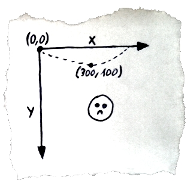

> 原文链接：https://www.codeproject.com/articles/598955/coordinateplussystemplusinplushtml-pluscanvas-cpl  

# canvas中的坐标系

> 在某些动画类型中，默认坐标系是不方便的，幸好，你可以使用转型方式来改变它...

HTML5 Canvas中的坐标系统以其原点（0, 0）位于左上角的方式是设置。这个解决方案在屏幕图形学领域并不新鲜（例如windows窗体和svg也是如此）。过去标准的CRT监视器从上到下显示图像行，并且从左到右创建行中的图像。因此，定位原点（0，0）在左上角是直观的，它使创建硬件和软件处理图形更容易。  

不幸的是有些时候，canvas中的默认坐标系统是有点不切实际的。让我们假设你想创建弹丸运动动画，对于上升的弹丸，y坐标是上升的这看起来是很自然的，但是这会导致一个很奇怪的效果：  
  

您可以通过修改传递给绘图方法的y值来解决这个问题：
```javascript
contexnt.fillRect(x, offsetY - y, size, size);
```

对于*y=0*，弹丸将被放置在由offsetY决定的位置（将offsetY设置为canvas的高度，以使y=0是画布的最底部）。 y的值愈大，弹跳将越会高，但是问题是你的代码中将会有几百个地方使用y坐标，如果你有一次忘记使用*offsetY*，那么整个图像可能被破坏。  

幸运的是，canvas允许你使用变换来改变坐标系统。有两种转换方法对我们很有用：translate(x, y)和scale(x, y)。前者允许我们将原点移动到任何位置，后者用于改变绘制对象的大小，但是它也可以用来反转坐标。  

单次执行以下代码将坐标系原点移动到点（0, offsetY），并建立y轴值随着朝向屏幕顶部的增加：  

```javascript
   context.translate(0, offsetY);
   context.scale(1, -1);
```

[translate and scale](img/canvas_coordinate/translate_and_scale_small.jpg)  

但是这里有个catch：提供-1作为scale的第二个参数的结果是整个图像是为倒置y坐标创建的。这也适用于文本（调用fillText将呈现字母上下颠倒）。因此，在写任何文本之前，您必须恢复默认的y轴配置。因为手动恢复画布状态是笨挫的，方法save()和restore()，这两个方法分别用于在堆栈上保存画布状态和从画布状态堆栈中恢复状态。建议在变换之前使用保存save方法。canvas的状态不仅包括变换，还包括一些如填充样式或者线宽之类的值...  

```javascript
 context.save();

 context.fillStyle = 'red';
 context.scale(2, 2);
 context.fillRect(0, 0, 10, 10);

 context.restore();

 context.fillRect(0, 0, 10, 10);
```  

以上代码绘制了2个正方形：
[draw 2 squares](img/canvas_coordinate/canvas_rects.png)  

第一个正方形是红色的且使用2倍刻度绘制，第二个正方形使用默认画布设置（颜色黑色和1倍刻度）。这发生是因为在对比例和颜色进行任何改变之前，画布状态被保存在堆栈上，之后再绘制第二个正方形之前被恢复了。