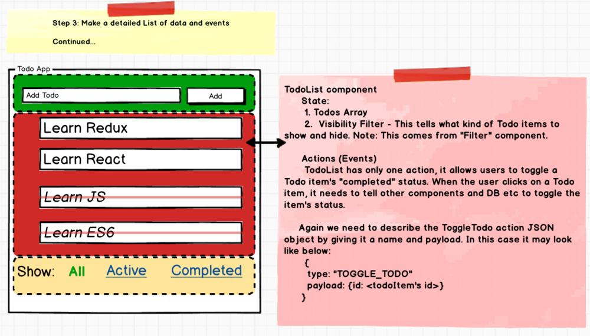
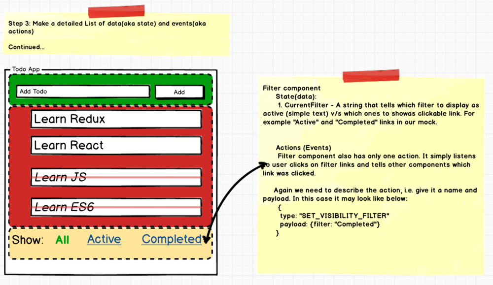
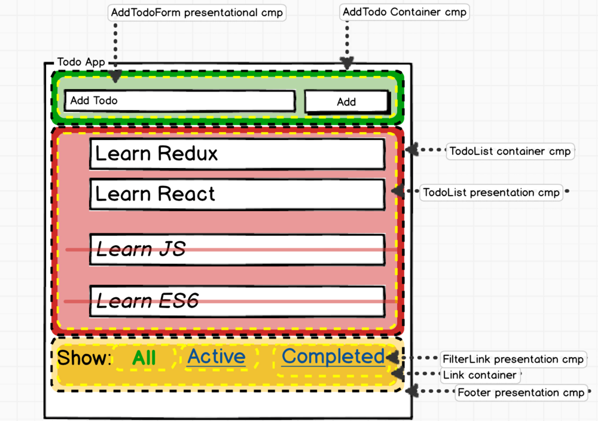
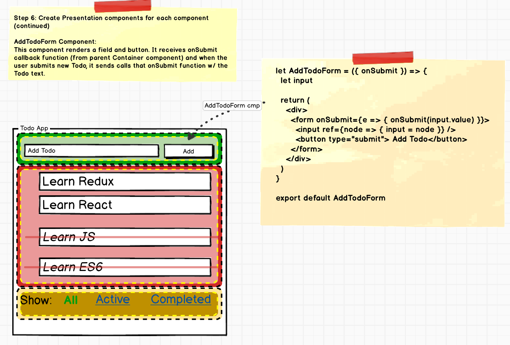
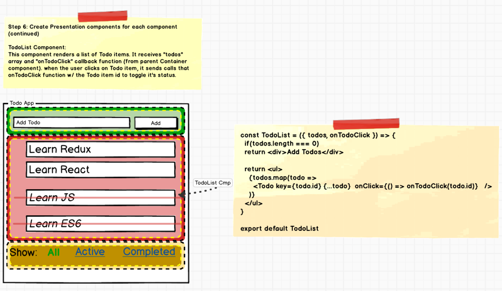
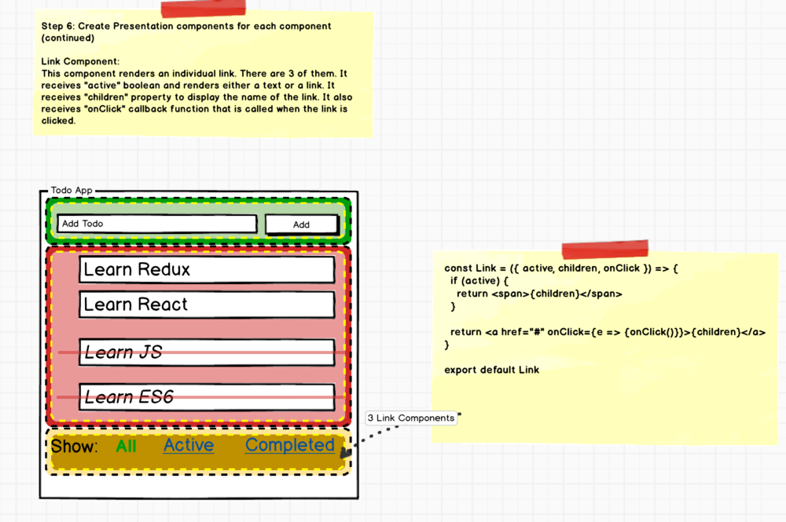
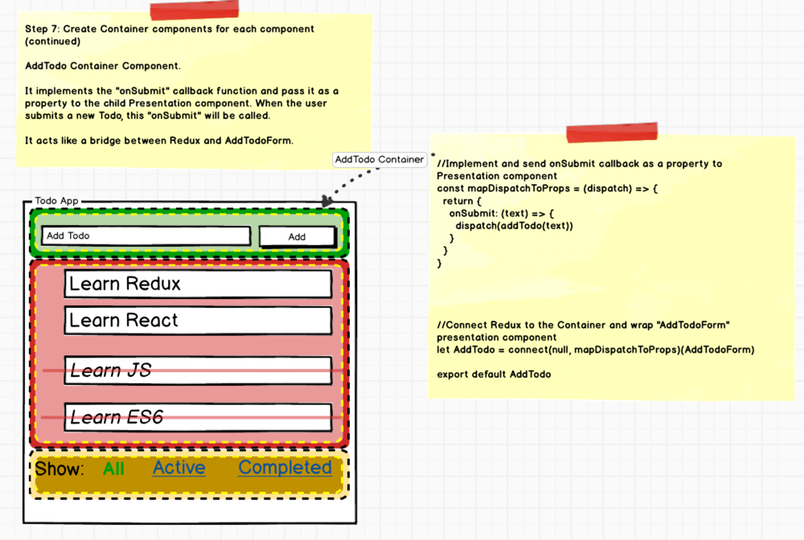
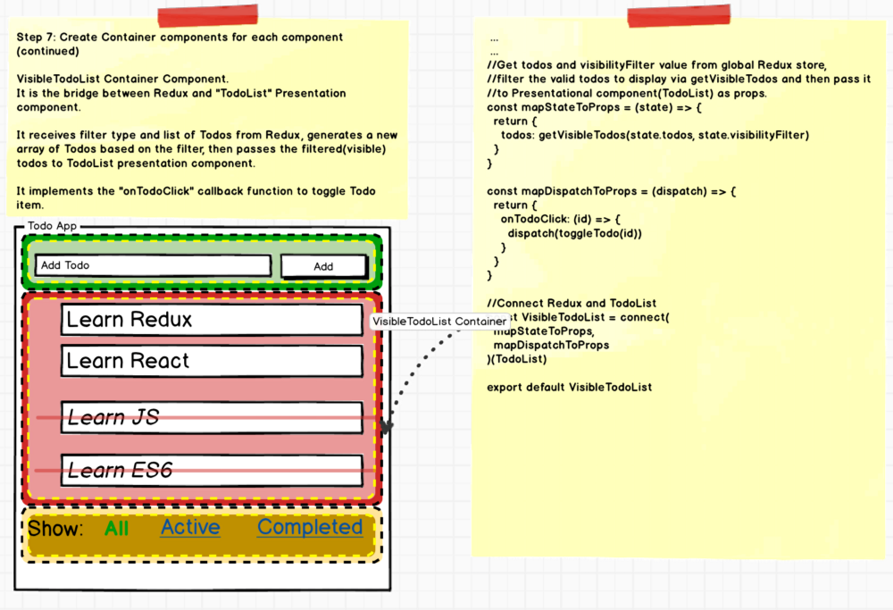
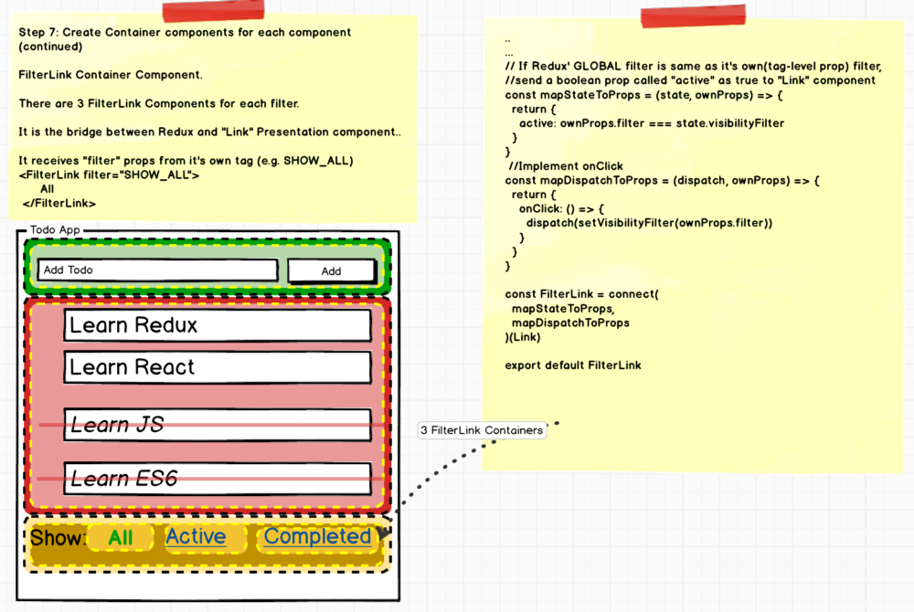

> 原文链接：https://medium.com/@rajaraodv/step-by-step-guide-to-building-react-redux-apps-using-mocks-48ca0f47f9a

Redux正在成为构建React应用程序公认的方式。目前已经有大量的示例来说明展示其用法。但是React-Redux应用程序由好几个部分组成，如：`Reducers`、`Actions`、`Action Creators`、`State`、`Middleware`等，这些是难以理解的！

当我开始学习它的时候，我没有找到关于“React-Redux的哪个部分首先构建？”的文章或者“如何最佳的构建React-Redux应用程序”。所以我经历了几个例子和博客，并提出了如何处理大多数React Redux应用程序的一般步骤。

## 为什么使用Redux？
React - 一个帮助我们把应用程序分解成多个组件的js库，但是react没有明确说明如何跟踪数据（state）以及如何正确的处理事件（action）

Redux - 一个免费的react库，其提供了一种轻松保存数据（state）和事件（action）的方法。

基本上Redux允许我们根据你的需要构建React应用程序，但将所有的state和action委托给Redux。

> 一个简单的todo应用程序有8个步骤，理论是，一些早期的框架在构建todo应用时非常简单，但是构建真实的应用程序很难，但是react redux恰恰相反。

让我们开始：

## 第一步：撰写一个详细的应用模拟

模拟需要包含所有的数据和视觉效果（如：列表项上面的删除线或者过滤里的“All”使用文字替代link）


## 第二步：将应用程序划分为组件

尝试根据每个组件的总体目的，将应用程序分为多个组件。

这里我们划分为3个组件：`AddTodo`、`TodoList`、`Filter`


## Redux术语：`Actions` 和 `State`
每一个组件都包含两个事物：
1. 根据一些数据渲染DOM，这些数据成为`state`。
2. 监听用户或其他事件并发送给js函数，这些被称作为`action`。

## 第三步：为每一个组件列出state和actions
请务必仔细查看第二步中的每一个组件，然后为它们列出state和actions列表。我们有3个组件`AddTodo`、`TodoList`和`Filter`,让我们来列出他们的action和state。

### 3.1 AddTodo组件：state和actions
在这个组件中，我们没有状态，因为组件外观和感觉根据任何数据都不会改变，但是需要让其他组件知道用户何时创建一个新的todo，我们称这个action为：`ADD_TODO`。


### 3.2 TodoList 组件：state和actions
TodoList组件需要一个todo项的数组来渲染自己，所以它需要一个state：`Todos`（Array类型）,除此之外，它还需要知道当前的`Filter`条件，来根据条件显示或隐藏todoitems，所以它还需要另外一个state，可以称为`VisibilityFilter`（boolen类型）。

再进一步，TodoList允许我们切换某个todoitem是否已经完成的状态而且还需要让其他组件知道这个切换，所以我们需要一个称为`TOGGLE_TODO`的action。



### 3.3 Filter组件：state和actions
`Filter`组件根据条件是否激活来渲染成link或者一个简单的文字，这里需要一个state：`CurrentFilter`。

当用户点击筛选条件时，`Filter`组件也需要告诉其它组件状态的切换，所以需要一个action：`SET_VIBILITY_FILTER`。



## Redux术语：`Action Creators`
Action Creators都是简单的函数，其主要职责是从DOM事件中接收数据，将其格式化为正式的`Action`json对象然后返回这个action对象。这有助于帮助我们规范化数据。

此外，它允许将来的任何其他组件也将这些动作发送给其他组件。

## 第四步：为每个action创建`action creators`
我们来为这三个(`ADD_TODO`,`TOGGLE_TODO`,`SET_VISIBILITY_FILTER`)action来创建action creators。

```javascript
// 1. 从AddTodo字段获取文本并返回适当的'Action'json对象，用以发送到其他组件
export const addTodo = (text) => {
    return {
        type: 'ADD_TODO',
        id: nextTodoId++,
        text, // ES6语法，相当于ES5中的text: text,
        completed: false // 默认未完成
    }
}

// 2. 获取过滤字符串并返回适当的'Action'json对象，用以发送到其他组件
export const setVisibilityFilter = (filter) => {
    return {
        type: 'SET_VISIBILITY_FILTER',
        filter
    }
}

// 3. 获取todo项的id并返回适当的'Action'json对象，用以发送到其他组件
export const toggleTodo = (id) => {
    return {
        type: 'TOGGLE_TODO',
        id
    }
}
```

## Redux术语：`Reducers`
Reducers是一个从Redux中接受state和"action"json对象的函数，其返回一个新的 `state`存储到Redux中。

1. 当有用户操作时，Reducer函数将会被'Container'调用。
2. 当reducer改变了state时，Redux会把新的state传递给每一个组件，react会重新渲染每一个组件。

举一个例子，下面的方法接受Redux的state（一个当前todos的数组），然后返回一个新的todos数组（new state），当action的type为`ADD_TODO`时，一个新的todo将会被添加进去。

```javascript
const todo = (state = [], action) => {
    switch (action.type) {
        case 'ADD_TODO':
            return [...state, {id: action.id, text: action.text, complete: false}];
    }
}
```

## 第五步：为每个action编写Reducers
注意：为了简洁，以下代码只是精简版，只是简单的展示了`ADD_TODO`,`TOGGLE_TODO`,`SET_VISIBILITY_FILTER`。  


```javascript
const todo = (state, action) => {
    switch (action.type) {
        case 'ADD_TODO': 
            return [...state, {id: action.id, text: action.text, 
              completed:false}];
        case 'TOGGLE_TODO':
            return state.map(todo => {
                if (todo.id !== action.id) {
                    return todo
                }
                return Object.assign({}, todo, {completed: !todo.completed})
            });
        case 'SET_VISIBILITY_FILTER': {
            return action.filter;
        }

        default:
            return state;
    }
}
```

## Redux术语:`Presentational`和`Container` 组件

在每个组件中编写React和Redux的逻辑，可能会造成混乱，所以Redux推荐创建一个名为`presentational`的虚拟演示组件和一个名为`Container`的父包裹组件，用于处理Redux，dispatch `action`等。

Container组件将数据传递给presentational组件，处理事件，代表presentational组件处理react。


图例：黄色虚线为presentational组件，黑色虚线为Container组件

## 第六步：实现每个presentational组件
### 6.1 实现AddTodoForm presentational组件

```javascript
let AddTodoForm = ({onSubmit}) => {
    let input;
    return (
        <div>
            <form onSubmit={e => {onSubmit(input.value)}}>
                <input ref={node => {input = node}} />
                <button type="submit">Add todo</button>
            </form>
        </div>
    )
}
```

### 6.2 实现TodoList presentational 组件


### 6.3 实现Link presentanional组件


注意：在实际的代码中，Link presentational组件被包装在FilterLink容器组件中。然后在Footer presentational 组件中显示3个FilterLink组件。

## 第七步：为presentatinal组件创建Container组件
这是最后为每个组件连接Redux。
### 7.1  创建container component：AddTodo


### 7.2 创建container component：TodoList Container


### 7.3 创建container component：Filter Container


## 第八步：最终把他们结合到一起
```javascript
import React from 'react' // ← Main React library
import { render } from 'react-dom' // ← Main react library
import { Provider } from 'react-redux' //← Bridge React and Redux
import { createStore } from 'redux' // ← Main Redux library
import todoApp from './reducers' // ← List of Reducers we created 
//Import all components we created earlier
import AddTodo from '../containers/AddTodo'
import VisibleTodoList from '../containers/VisibleTodoList'
import Footer from './Footer' // ← This is a presentational component that contains 3 FilterLink Container comp
//Create Redux Store by passing it the reducers we created earlier.
let store = createStore(reducers)
render(
    <Provider store={store}> ← The Provider component from react-redux injects the store to all the child components
        <div>
            <AddTodo />
            <VisibleTodoList />
            <Footer />
        </div>
    </Provider>,
 document.getElementById(‘root’) //<-- Render to a div w/ id "root"
)
```