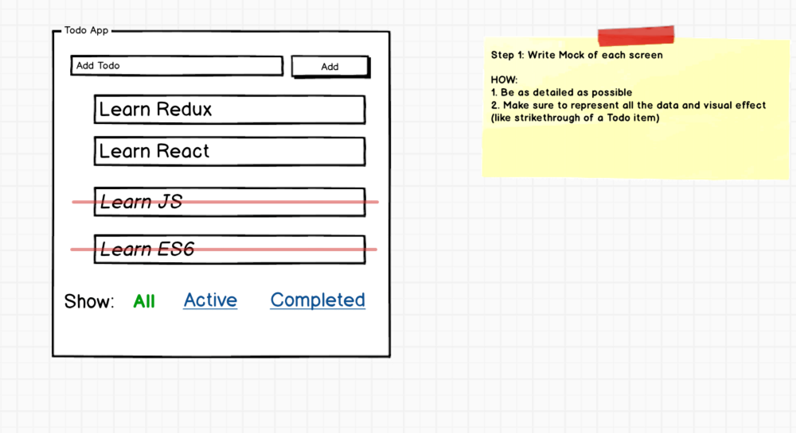
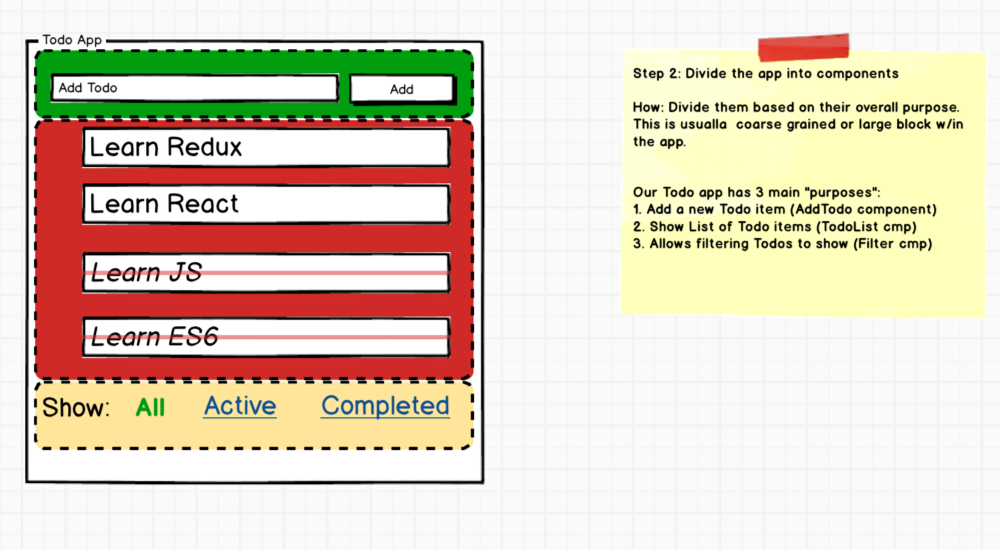
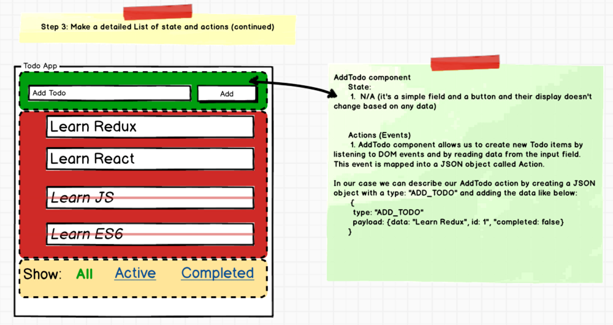

> 原文链接：https://medium.com/@rajaraodv/step-by-step-guide-to-building-react-redux-apps-using-mocks-48ca0f47f9a

Redux正在成为构建React应用程序公认的方式。目前已经有大量的示例来说明展示其用法。但是React-Redux应用程序由好几个部分组成，如：`Reducers`、`Actions`、`Action Creators`、`State`、`Middleware`等，这些是难以理解的！

当我开始学习它的时候，我没有找到关于“React-Redux的哪个部分首先构建？”的文章或者“如何最佳的构建React-Redux应用程序”。所以我经历了几个例子和博客，并提出了如何处理大多数React Redux应用程序的一般步骤。

## 为什么使用Redux？
React - 一个帮助我们把应用程序分解成多个组件的js库，但是react没有明确说明如何跟踪数据（state）以及如何正确的处理事件（action）

Redux - 一个免费的react库，其提供了一种轻松保存数据（state）和事件（action）的方法。

基本上Redux允许我们根据你的需要构建React应用程序，但将所有的state和action委托给Redux。

> 一个简单的todo应用程序有8个步骤，理论是，一些早期的框架在构建todo应用时非常简单，但是构建真实的应用程序很难，但是react redux恰恰相反。

让我们开始：

## 第一步：撰写一个详细的应用模拟

模拟需要包含所有的数据和视觉效果（如：列表项上面的删除线或者过滤里的“All”使用文字替代link）

## 第二步：将应用程序划分为组件

尝试根据每个组件的总体目的，将应用程序分为多个组件。

这里我们划分为3个组件：`AddTodo`、`TodoList`、`Filter`

### Redux术语：`Actions` 和 `State`
每一个组件都包含两个事物：
1. 根据一些数据渲染DOM，这些数据成为`state`。
2. 监听用户或其他事件并发送给js函数，这些被称作为`action`。

## 第三步：为每一个组件列出state和actions
请务必仔细查看第二步中的每一个组件，然后为它们列出state和actions列表。我们有3个组件`AddTodo`、`TodoList`和`Filter`,让我们来列出他们的action和state。

### 3.1 AddTodo组件：state和actions
在这个组件中，我们没有状态，因为组件外观和感觉根据任何数据都不会改变，但是需要让其他组件知道用户何时创建一个新的todo，我们称这个action为：`ADD_TODO`。

### 3.2 TodoList 组件：state和actions
TodoList组件需要一个todo项的数组来渲染自己，所以它需要一个state：Todos（Array类型）。它还需要知道