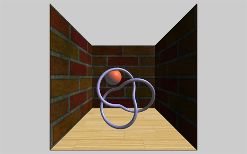
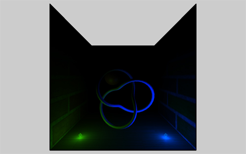
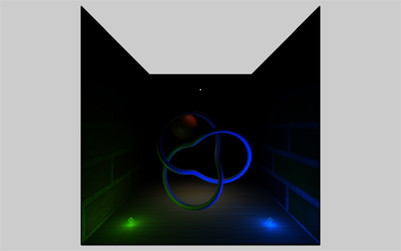
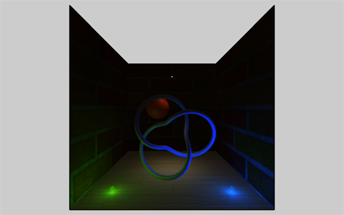

> 原文链接：https://solutiondesign.com/blog/-/blogs/webgl-and-three-js-lighting/
> 


# WebGL and Threejs: Lightig

## 什么是webgl和threejs？

webgl是一个在浏览器中用来把3D图形渲染到屏幕上的javascript API。使用webgl的api直接来编程可能是复杂和杂乱的，但是幸运的是我们有一些库来简化这点。Three.js就是其中一个库。

## Threejs

Threejs是一个轻量的3D库，隐藏了很多WebGL的复杂性，使得在开始在网络3D编程上变得非常简单。threejs可以在[github](https://github.com/mrdoob/three.js/)或者[thereejs的网站](http://threejs.org/)上下载，在那里你还可以发现文档和示例的链接。

在我的第一个教程中，我向你展示了如何构建一个基本的Threejs应用程序。在那个教程中，我谈到了设置舞台，构建场景和一个简单的立方体动画。在我的第二个教程中，我解释了纹理贴图，并展示了使用Threejs纹理对象的三种不同方法。

在本教程中，我将讨论Threejs的灯光。我将解释以下五种类型的灯以及如何使用每种灯：定向灯（directional lights），环境灯（ambient lights），点灯（point lights），聚光灯（spot lights）和半球灯（hemisphere lights）。

查看此示例，你需要一个兼容webgl的浏览器，如果你使用的是最新版本的任何主流浏览器，你应该可以查看它。如果你使用的是老的ie版本或者在手机设备上查看，你就没那么幸运了。你可以[点此查看本教程的示例](http://thegregstier.appspot.com/three-light-tut.html)，也可以在[这里](http://sdg.repositoryhosting.com/git_public/sdg/sdg-blog.git/tree/HEAD:/Three-js-examples?js=1)找到源代码。


## 灯光的艺术

大多数人在做3D游戏或者场景时，对于灯光并不会真的想得太多---毕竟，每个人都知道困难的部分是找到完美的模型和纹理，然后你花几个小时把他们放到一个完美的场景中。一旦你完成，你需要添加一个光源，并惊叹你的新创作。除了，当你看着你的新场景，你不能不觉得有些东西丢失了。这是因为，在我们日常生活中很少欣赏灯光对我们正在看的色调，颜色，心情和氛围有多少贡献。照明可以通过调整照明将您的场景从幸福的安全场景转变为黑暗和不详的场景。

本教程将介绍threejs中不同类型的灯光，并解释如何在技术上使用每个灯光。这不是一个良好的艺术照明技术的教程，因为，说实话，我是一个可怕的艺术家。

## 入门
在本教程中，我们将会以一个简单的HTML文件，类似于我在上一个教程中使用的：
```html
<!DOCTYPE HTML>
<html>
  <head>
    <title>WebGL/Three.js Light Tutorial</title>
    <style>
      body {
        background-color:#cccccc;
        margin: 0px;
        overflow: hidden;
      }
    </style>
  </head>
  <body>
    <script src="js/three.min.js"></script>
    <script src="js/OrbitControls.js"></script>
        <script src="js/three-light-tut.js"></script>
  </body>
</html>
```

这个HTML假设你已经下载了压缩版的three.js库且保存到来js目录下，假设你已经拷贝了OrbitControls.js到相同目录下了。OrbitControls.js可以在threejs的包里的`examples\js\controls`目录下找到。OrbitControls 允许通过点击左键拖拽来旋转场景、点击右键拖拽来平移场景、以及通过鼠标滚轮来缩放。我也创建了我的js `three-light-tut.js`，且把它保存在js文件夹中。以下是我们应用程序的起始代码：

```javascript
var camera;
var scene;
var renderer;
var controls;
  
init();
animate();
  
function init() {
  
    // Create a scene
    scene = new THREE.Scene();
  
    // Add the camera
    camera = new THREE.PerspectiveCamera( 70, window.innerWidth / window.innerHeight, 1, 1000);
    camera.position.set(0, 100, 250);
  
    // Add scene elements
    addSceneElements();
  
    // Add lights
    addLights();
  
    // Create the WebGL Renderer
    renderer = new THREE.WebGLRenderer();
    renderer.setSize( window.innerWidth, window.innerHeight );
  
    // Append the renderer to the body
    document.body.appendChild( renderer.domElement );
  
    // Add a resize event listener
    window.addEventListener( 'resize', onWindowResize, false );
  
    // Add the orbit controls
    controls = new THREE.OrbitControls(camera, renderer.domElement);
    controls.target = new THREE.Vector3(0, 100, 0);
}
  
function addLights() {
    var dirLight = new THREE.DirectionalLight(0xffffff, 1);
    dirLight.position.set(100, 100, 50);
    scene.add(dirLight);
}
  
function addSceneElements() {
    // Create a cube used to build the floor and walls
    var cube = new THREE.CubeGeometry( 200, 1, 200);
  
    // create different materials
    var floorMat = new THREE.MeshPhongMaterial( { map: THREE.ImageUtils.loadTexture('images/wood-floor.jpg') } );
    var wallMat = new THREE.MeshPhongMaterial( { map: THREE.ImageUtils.loadTexture('images/bricks.jpg') } );
    var redMat = new THREE.MeshPhongMaterial( { color: 0xff3300, specular: 0x555555, shininess: 30 } );
    var purpleMat = new THREE.MeshPhongMaterial( { color: 0x6F6CC5, specular: 0x555555, shininess: 30 } );
  
    // Floor
    var floor = new THREE.Mesh(cube, floorMat );
    scene.add( floor );
  
    // Back wall
    var backWall = new THREE.Mesh(cube, wallMat );
    backWall.rotation.x = Math.PI/180 * 90;
    backWall.position.set(0,100,-100);
    scene.add( backWall );
  
    // Left wall
    var leftWall = new THREE.Mesh(cube, wallMat );
    leftWall.rotation.x = Math.PI/180 * 90;
    leftWall.rotation.z = Math.PI/180 * 90;
    leftWall.position.set(-100,100,0);
    scene.add( leftWall );
  
    // Right wall
    var rightWall = new THREE.Mesh(cube, wallMat );
    rightWall.rotation.x = Math.PI/180 * 90;
    rightWall.rotation.z = Math.PI/180 * 90;
    rightWall.position.set(100,100,0);
    scene.add( rightWall );
  
    // Sphere
    var sphere = new THREE.Mesh(new THREE.SphereGeometry(20, 70, 20), redMat);
    sphere.position.set(-25, 100, -20);
    scene.add(sphere);
  
    // Knot thingy
    var knot = new THREE.Mesh(new THREE.TorusKnotGeometry( 40, 3, 100, 16 ), purpleMat);
    knot.position.set(0, 60, 30);
    scene.add(knot);
}
  
function animate() {
    renderer.render( scene, camera );
    requestAnimationFrame( animate );
    controls.update();
}
  
function onWindowResize() {
    camera.aspect = window.innerWidth / window.innerHeight;
    camera.updateProjectionMatrix();
    renderer.setSize( window.innerWidth, window.innerHeight );
}
```

如果你现在运行这个示例，你将会看到一个如下所示的简单场景，它包含了木地板，三面墙，一个红色球，和一个紫色圆环结。


我们将主要关注`addLights()`这行代码。事实上，如果你现在看看这个函数，可以看到我们为场景定义了一个光：定向光（directional light）。

## directional light 定向光
directional light 是创建户外场景时常用的照明形式，但可用在任何场景上。定向光类似于太阳的光。它是以恶搞非常遥远的光，在一个方向闪耀。就像太阳一样，因为它是非常远的，所有的光线互相平行。此外，这个光的行为好像是无限远，所以光的位置是没有关系的，只有光的角度有影响。这里是我们光线的代码：
```javascript
var dirLight = new THREE.DirectionalLight(0xffffff, 1);
dirLight.position.set(100, 100, 50);
scene.add(dirLight);
```

在第一行中，我们用两个参数来创建light：光线的颜色和光的强度或亮度。你可以随意调整它们，看看如何影响场景。第二行代码是设置光源的位置，最后第三行，将光源添加到我们的场景中。

既然之前说到位置没有关系，为什么我们要设置光的位置呢？原因是因为在threejs中，光的方向不是由光的旋转确定的，而是通过从其当前位置和其目标的位置计算角度。由于我没有指定目标位置，默认的目标位子是0,0,0原点。我可以通过不移动光源的位置和为我们的光源指定一个目标位置（-100, -100, -50）来达到一样的效果。

## Ambient Light 环境光 

让我们通过在`addLights()`方法的结尾添加两行代码开始
```javascript
var ambLight = new THREE.AmbientLight(0x404040);
scene.add(ambLight);
```

环境光只有一个属性：颜色。第一行代码创建了一个柔和灰色的环境光。如果你刷新你的浏览器，你会看到添加这个灯引起的变化，场景中的所有的物体都添加了平坦的灰色阴影。事实上，它看起来很不好，那是因为环境光并不是真正的光。它只是我之前说的，给整个场景添加一些颜色的平阴影。我曾经给过一个使用环境光的提示：  

1. 完整的移除它。
2. 添加所有其他灯光。
3. 如果场景的某些部分没有被任何主灯照亮，那么只需添加足够的环境光，使这些黑暗的角落可见。
4. 如果仍然看起来不好，请回到第一步。  


我们加上环境光就像这样了：  


## point Lights 点光源

点光源是像灯泡一样工作的灯光：你把它放置在一个位置，它们会照向各个方向，点亮任何在他们范围的区域。

让我们删除所有现有的灯光，用以下内容替换掉`addLights()`方法中的内容：

```javascript
var bluePoint = new THREE.PointLight(0x0033ff, 3, 150);
bluePoint.position.set( 70, 5, 70 );
scene.add(bluePoint);
scene.add(new THREE.PointLightHelper(bluePoint, 3));
  
var greenPoint = new THREE.PointLight(0x33ff00, 1, 150);
greenPoint.position.set( -70, 5, 70 );
scene.add(greenPoint);
scene.add(new THREE.PointLightHelper(greenPoint, 3));
```

我们创建了2个点光源，一个蓝色一个绿色。点光源的构造函数需要3个属性：光的颜色、强度、和强度下降到0的距离（光的范围）。如果设置距离为0，那么距离是无限的。在前三行中，我们创建了一个点光源，设置其位置并且将它加入到场景中。第四行添加一个PointLightHelper，对于向场景添加光，PointLightHelper并不是必须的。它是一个帮助类，可以在创建场景的同时在光的位置放置一个wireframed球体，使其更容易可视化。

在删除现有光源并且添加绿色和蓝色点光源后，我们的场景如下所示：  



## spot Light  射灯

接下来我们添加一个射灯到场景中。聚光灯正如它的名字那样：从一个方向上的给定点照射的光形成圆锥形状。

将以下代码添加到`addLights()`方法的结尾部分：  
```javascript
var spotLight = new THREE.SpotLight(0xffffff, 1, 200, 20, 10);
spotLight.position.set( 0, 150, 0 );
  
var spotTarget = new THREE.Object3D();
spotTarget.position.set(0, 0, 0);
spotLight.target = spotTarget;
  
scene.add(spotLight);
scene.add(new THREE.PointLightHelper(spotLight, 1));
```

正如你第一行看到的，我们为spotlight的构造器指定了5个参数：颜色，强度，距离，角度和指数。之前我们已经使用过颜色，强度和距离，这里新增了2个：角度和指数。
1. 角度是锥形将采取的角度，或者点将是多宽。  
2. 指数是指光从目标方向落到0的速度。数字越高，光线越暗。


在第二行，我们给light设置了位置，在接下来的第三行，我们创建了一个Object3D，设置它的位置为0,0,0。然后将这个对象设置为spotlight的目标。就像定向光，聚光灯所面对的方向不是由光的旋转决定的，而是通过找到光及其目标的角度来计算。在这种情况下，我们设置目标为一个通用的Object3D类实例。在threejs中Object3D是所以3D object的父类。所以我们可以很容易地将我们的聚光灯的目标设置成任意场景元素，比如球体。那样，如果我们对球体进行动画处理，聚光灯会自动跟踪球体。事实上，我们将添加一点动画到我们的聚光灯，你可以刷新浏览器看到如下：  




## Hemisphere Light 半球光

如你看到的，我们的场景还是比较暗，特别是房间后面的角落。我们可以添加一个低强度的定向光，或少量的环境光照亮这些区域，但接下来我要添加另一种称为半球光的光。半球光与环境光类似，因为它没有位置或方向。

添加以下代码到`addLights()`函数的结尾：  

```javascript
var hemLight = new THREE.HemisphereLight(0xffe5bb, 0xFFBF00, .1);
scene.add(hemLight);
```

如你看到的，半球光的构造器有3个属性，前两个是颜色，第三个是强度。为什么有2个颜色呢？半球照明是一种添加一些环境照明的方式，但有一点更现实主义。第一种颜色代表来自我们模型上方的光的颜色，像太阳或者天花板灯。第二种颜色是来自我们模型下方的光的颜色，表示地面反射的太阳的颜色或反射离开地板的天花板灯的颜色。这两种颜色的梯度应用于我们场景中的模型。就像其他灯，我们可以指定这种光的强度。它为我们提供了比环境光更多的微调控制。

刷新浏览器，可以看到如下场景：  

 

区别很小，但是你应该注意到，你现在可以看到场景的后角了。

threejs为你的场景提供了广泛的选择，每一种灯源都包含大量的选项，如颜色，距离和强度等。当彼此结合使用时，照明场景的可能性几乎是无限的。

在结束本教程之前，我想做最后一个调整，使我们的场景更加动态。我要动画的聚光灯，以便它模拟一个吊灯从电线上来回摆动的天花板灯。

为此，我们首先需要将spotLight变量声明为全局变量，这样我们可以在`animate()`函数中使用它，我们再声明一个计数器的变量。

添加以下代码到应用的最上面：  

```javascript
var spotLight;
var counter = 0;
```

把`addLight()`函数带代码由下面: 
```javascript
var spotLight = new THREE.SpotLight(0xffffff, 1, 200, 20, 10);
```
改为：
```javascript
spotLight = new THREE.SpotLight(0xffffff, 1, 200, 20, 10);
```

再添加以下代码到`animate()`函数中：
```javascript
counter += .1;
spotLight.target.position.x = Math.sin(counter) * 100;
```

我们在这里所做的是更新聚光灯所指向的X位置。我使用正弦波计算位置，所以我们得到一个很好的平滑摆动效果。

刷新你的浏览器，应该看到聚光灯来回摆动。

## 结论
Threejs提供了许多不同的光源可以在场景里使用，每一个光源提供了一些不同的选项来控制光源的效果。当组合使用时，你有无尽的选择来增强你的3D场景。在使用灯源方面没有正确或错误，只是玩弄他们得到你想要的效果。祝你好运和快乐使用灯光！