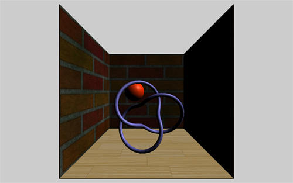

> 原文链接：https://solutiondesign.com/blog/-/blogs/webgl-and-three-js-lighting/
> 


# WebGL and Threejs: Lightig

## 什么是webgl和threejs？

webgl是一个在浏览器中用来把3D图形渲染到屏幕上的javascript API。使用webgl的api直接来编程可能是复杂和杂乱的，但是幸运的是我们有一些库来简化这点。Three.js就是其中一个库。

## Threejs

Threejs是一个轻量的3D库，隐藏了很多WebGL的复杂性，使得在开始在网络3D编程上变得非常简单。threejs可以在[github](https://github.com/mrdoob/three.js/)或者[thereejs的网站](http://threejs.org/)上下载，在那里你还可以发现文档和示例的链接。

在我的第一个教程中，我向你展示了如何构建一个基本的Threejs应用程序。在那个教程中，我谈到了设置舞台，构建场景和一个简单的立方体动画。在我的第二个教程中，我解释了纹理贴图，并展示了使用Threejs纹理对象的三种不同方法。

在本教程中，我将讨论Threejs的灯光。我将解释以下五种类型的灯以及如何使用每种灯：定向灯（directional lights），环境灯（ambient lights），点灯（point lights），聚光灯（spot lights）和半球灯（hemisphere lights）。

查看此示例，你需要一个兼容webgl的浏览器，如果你使用的是最新版本的任何主流浏览器，你应该可以查看它。如果你使用的是老的ie版本或者在手机设备上查看，你就没那么幸运了。你可以[点此查看本教程的示例](http://thegregstier.appspot.com/three-light-tut.html)，也可以在[这里](http://sdg.repositoryhosting.com/git_public/sdg/sdg-blog.git/tree/HEAD:/Three-js-examples?js=1)找到源代码。


## 灯光的艺术

大多数人在做3D游戏或者场景时，对于灯光并不会真的想得太多---毕竟，每个人都知道困难的部分是找到完美的模型和纹理，然后你花几个小时把他们放到一个完美的场景中。一旦你完成，你需要添加一个光源，并惊叹你的新创作。除了，当你看着你的新场景，你不能不觉得有些东西丢失了。这是因为，在我们日常生活中很少欣赏灯光对我们正在看的色调，颜色，心情和氛围有多少贡献。照明可以通过调整照明将您的场景从幸福的安全场景转变为黑暗和不详的场景。

本教程将介绍threejs中不同类型的灯光，并解释如何在技术上使用每个灯光。这不是一个良好的艺术照明技术的教程，因为，说实话，我是一个可怕的艺术家。

## 入门
在本教程中，我们将会以一个简单的HTML文件，类似于我在上一个教程中使用的：
```html
<!DOCTYPE HTML>
<html>
  <head>
    <title>WebGL/Three.js Light Tutorial</title>
    <style>
      body {
        background-color:#cccccc;
        margin: 0px;
        overflow: hidden;
      }
    </style>
  </head>
  <body>
    <script src="js/three.min.js"></script>
    <script src="js/OrbitControls.js"></script>
        <script src="js/three-light-tut.js"></script>
  </body>
</html>
```

这个HTML假设你已经下载了压缩版的three.js库且保存到来js目录下，假设你已经拷贝了OrbitControls.js到相同目录下了。OrbitControls.js可以在threejs的包里的`examples\js\controls`目录下找到。OrbitControls 允许通过点击左键拖拽来旋转场景、点击右键拖拽来平移场景、以及通过鼠标滚轮来缩放。我也创建了我的js `three-light-tut.js`，且把它保存在js文件夹中。以下是我们应用程序的起始代码：

```javascript
var camera;
var scene;
var renderer;
var controls;
  
init();
animate();
  
function init() {
  
    // Create a scene
    scene = new THREE.Scene();
  
    // Add the camera
    camera = new THREE.PerspectiveCamera( 70, window.innerWidth / window.innerHeight, 1, 1000);
    camera.position.set(0, 100, 250);
  
    // Add scene elements
    addSceneElements();
  
    // Add lights
    addLights();
  
    // Create the WebGL Renderer
    renderer = new THREE.WebGLRenderer();
    renderer.setSize( window.innerWidth, window.innerHeight );
  
    // Append the renderer to the body
    document.body.appendChild( renderer.domElement );
  
    // Add a resize event listener
    window.addEventListener( 'resize', onWindowResize, false );
  
    // Add the orbit controls
    controls = new THREE.OrbitControls(camera, renderer.domElement);
    controls.target = new THREE.Vector3(0, 100, 0);
}
  
function addLights() {
    var dirLight = new THREE.DirectionalLight(0xffffff, 1);
    dirLight.position.set(100, 100, 50);
    scene.add(dirLight);
}
  
function addSceneElements() {
    // Create a cube used to build the floor and walls
    var cube = new THREE.CubeGeometry( 200, 1, 200);
  
    // create different materials
    var floorMat = new THREE.MeshPhongMaterial( { map: THREE.ImageUtils.loadTexture('images/wood-floor.jpg') } );
    var wallMat = new THREE.MeshPhongMaterial( { map: THREE.ImageUtils.loadTexture('images/bricks.jpg') } );
    var redMat = new THREE.MeshPhongMaterial( { color: 0xff3300, specular: 0x555555, shininess: 30 } );
    var purpleMat = new THREE.MeshPhongMaterial( { color: 0x6F6CC5, specular: 0x555555, shininess: 30 } );
  
    // Floor
    var floor = new THREE.Mesh(cube, floorMat );
    scene.add( floor );
  
    // Back wall
    var backWall = new THREE.Mesh(cube, wallMat );
    backWall.rotation.x = Math.PI/180 * 90;
    backWall.position.set(0,100,-100);
    scene.add( backWall );
  
    // Left wall
    var leftWall = new THREE.Mesh(cube, wallMat );
    leftWall.rotation.x = Math.PI/180 * 90;
    leftWall.rotation.z = Math.PI/180 * 90;
    leftWall.position.set(-100,100,0);
    scene.add( leftWall );
  
    // Right wall
    var rightWall = new THREE.Mesh(cube, wallMat );
    rightWall.rotation.x = Math.PI/180 * 90;
    rightWall.rotation.z = Math.PI/180 * 90;
    rightWall.position.set(100,100,0);
    scene.add( rightWall );
  
    // Sphere
    var sphere = new THREE.Mesh(new THREE.SphereGeometry(20, 70, 20), redMat);
    sphere.position.set(-25, 100, -20);
    scene.add(sphere);
  
    // Knot thingy
    var knot = new THREE.Mesh(new THREE.TorusKnotGeometry( 40, 3, 100, 16 ), purpleMat);
    knot.position.set(0, 60, 30);
    scene.add(knot);
}
  
function animate() {
    renderer.render( scene, camera );
    requestAnimationFrame( animate );
    controls.update();
}
  
function onWindowResize() {
    camera.aspect = window.innerWidth / window.innerHeight;
    camera.updateProjectionMatrix();
    renderer.setSize( window.innerWidth, window.innerHeight );
}
```

如果你现在允许这个示例，你将会看到一个如下所示的简单场景，它包含了木地板，三面墙，一个红色球，和一个紫色圆环结。



从这点上，我们将主要关注`addLights()`这行代码。事实上，如果你现在看看这个功能，你可以看到我们为我们的场景定义了一个光：定向光（directional light）。

## directional light 定向光